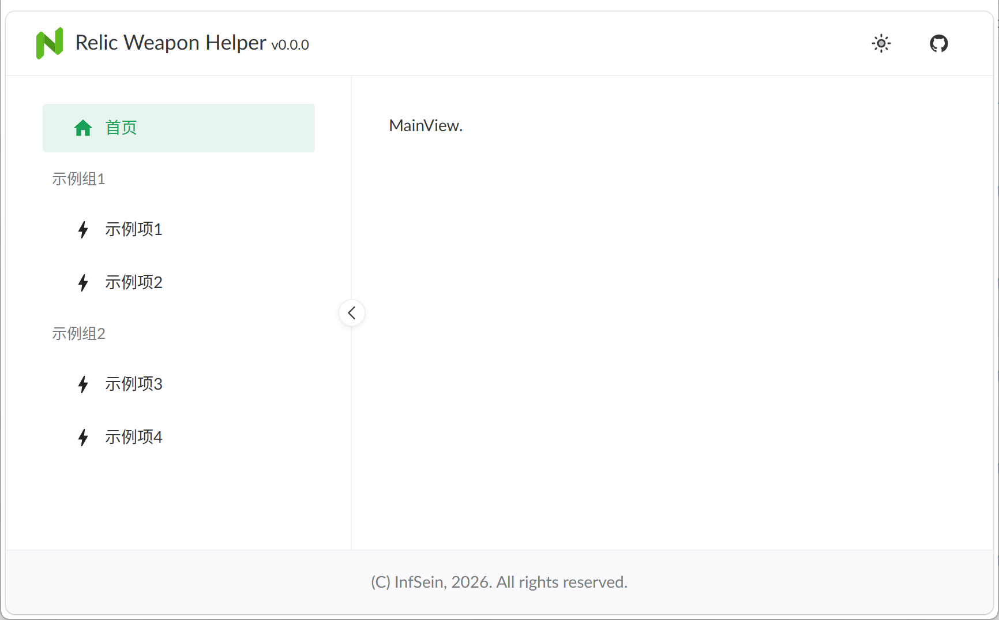

# MyVue

自用的项目模板，提前配置好大多数通用依赖／框架／基本UI，从而将更多的时间投入到业务逻辑的开发中。

## 使用方法

1. 下载项目源代码
2. 调整以下文件：
    - [./package.json](./package.json)
    - [./src/constants/app-info.ts](./src/constants/app-info.ts)
    - [./src/assets/icons/app-logo.svg](./src/assets/icons/app-logo.svg)
    - 删除 [./docs/preview.png](./docs/preview.png)
3. 运行 `npm i`
4. 开始开发

## 框架预览

